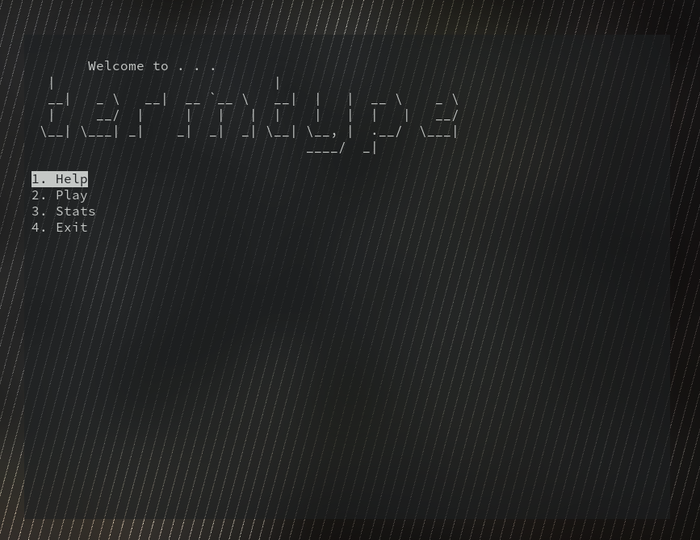
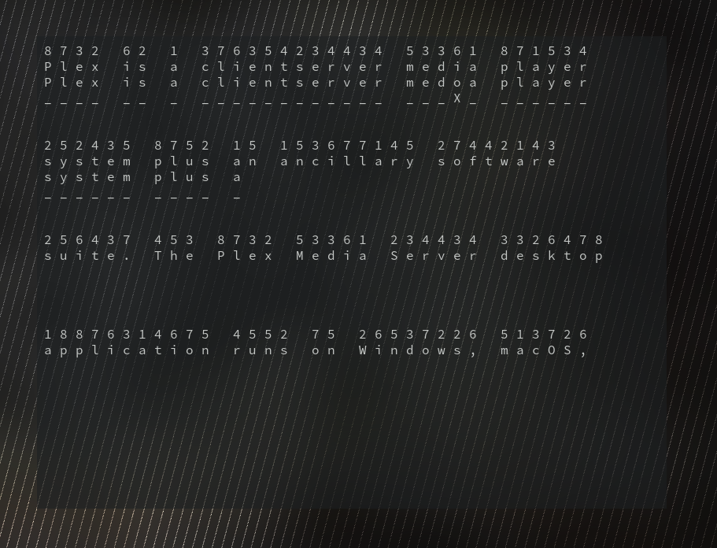

# termtype

A Curses-based Python application to practice touch-typing by typing out random Wikipedia articles

### Installation

1. Optionally create and enter virtual environment:
- `python -m venv venv`
- `source venv/bin/activate`
2. Install required packages: `pip install -r requirements.txt`
3. Run application: `python termtype.py`
Commands may differ, for example, pip3 instead of pip, python3 instead of python.

### Usage
Select play from the menu to play the game. A random wikipedia article will be loaded for you to type. Any incorrect characters will be marked with an X. Additionally, above the Wikipedia text will be an indication of which finger should be used to type that particular key:
1. Left pinky
2. Left ring
3. Left middle
4. Left index
5. Right index
6. Right middle
7. Right ring
8. Right pinky

Press enter after every line, every sentence, or whenever you prefer to clear words on the screen. After finishing the text you will be brought to a statistics screen, which is also accessible through the main menu. You can also press escape at any time to quit typing, the words you've entered will still be counted towards your statistics.

### Notes
- I chose not to use Curses to render characters directly, and instead render the entire page at once. This was to ensure that the terminal can be resized without adversely affecting gameplay. This means that the text automatically word wraps to display properly.

